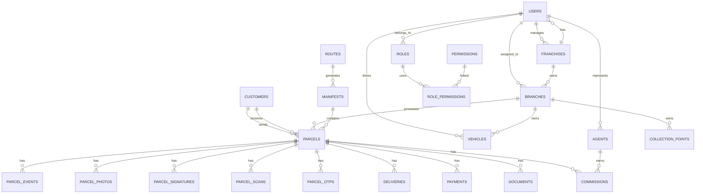

# Database ERD

## Entity Relationship Overview

Mermaid ERD:

## Core tables
- `users`
- `roles`
- `permissions`
- `franchises`
- `branches`
- `customers`
- `collection_points`
- `agents`
- `vehicles`
- `routes`
- `manifests`
- `parcels`
- `parcel_events`
- `parcel_photos`
- `parcel_signatures`
- `parcel_scans`
- `parcel_otps`
- `deliveries`
- `payments`
- `expenses`
- `commissions`
- `documents`
- `notifications`
- `audit_logs`

## Relationship summary
- Customers are linked to parcels as senders and receivers.
- Parcels are assigned to routes, branches, manifests, drivers, collection points, and agents.
- Every parcel action is recorded in `parcel_events` to preserve audit history.
- Franchise revenue and royalties are computed from branch, parcel, and commission data.
- Notifications and documents are connected to parcels and customers for operational history.
