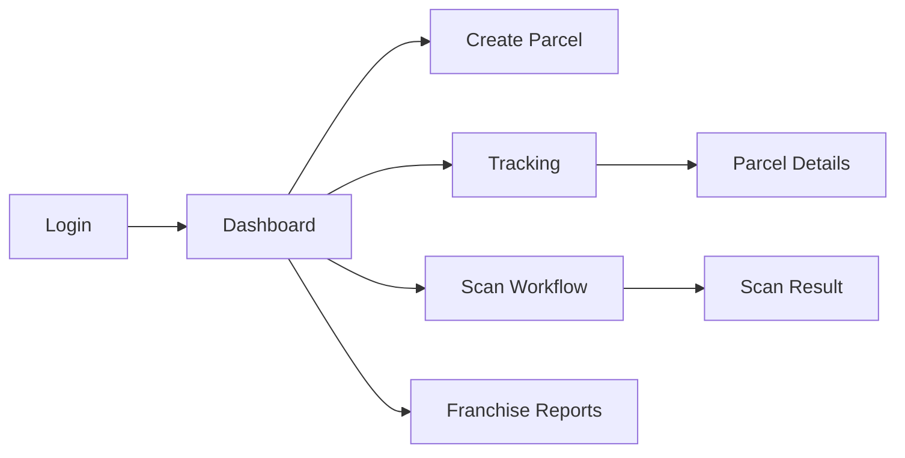

# UI Wireframes

## 1. Dashboard

- Global KPI cards: Parcels In Transit, Delivered Today, Pending OTP, Active Routes, Franchise Revenue.
- Map widget showing live parcel clusters and route statuses.
- Quick action buttons: Create Parcel, Scan Parcel, Generate Manifest, Open Customer Portal.
- Alerts panel for failed deliveries, overdue pickups, and vehicle maintenance.

## 2. Parcel Tracking Portal

- Search bar for tracking number.
- Status timeline with milestones: Accepted, Packed, Loaded, In Transit, Arrived Hub, Out For Delivery, Delivered.
- Delivery details panel with collection point, expected arrival, and OTP verification status.
- Map panel showing last known GPS and route.

## 3. Parcel Creation

- Stepper form: Sender details -> Receiver details -> Package details -> Delivery options -> Confirmation.
- Landmark address entry with optional GPS pin drop.
- Collection point and delivery point selection.
- Payment options: Cash on Delivery, Prepaid.

## 4. Scanning Workflow

- Scan screen for QR/Barcode.
- Status picker: Accept, Load, Dispatch, Receive, Transfer, Deliver, Return.
- GPS and photo capture on scan completion.
- Device mode for drivers and shop assistants.

## 5. Franchise Console

- Franchise summary card with revenue, royalties, active branches, and commission status.
- Branch list with parcel counts and pickup volumes.
- Compliance and royalty statement generator.

## 6. Customer Profile

- Customer details, communication preferences, addresses, and parcel history.
- Corporate customer fields for company name, tax IDs, and billing profile.
- Notes and support tickets panel.

## 7. Mobile-first considerations

- Bottom navigation for Tracking, New Shipment, Scan, Messages, Profile.
- Large touch targets and minimal navigation layers.
- Offline-friendly scan and submit flows with local persistence.

## Sample Mermaid flow

